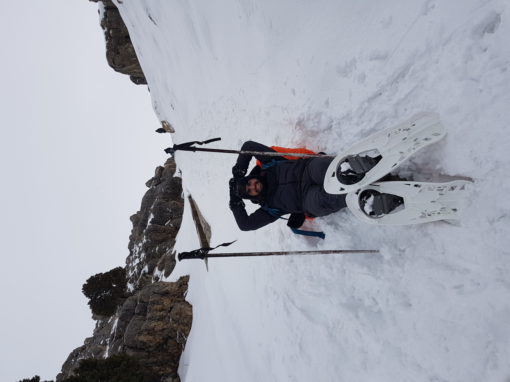

### Khaled Al Houssein
##### INFORMATION TECHNOLOGY GRADUATE


***
##### PROFILE
###### MIS graduate from the Lebanese University with a proactive mentality, eye for details and precision. Worked on developing, programming and hosting a Full-stack web page using several programming languages.


##### Education

###### 2015 - 2018 :
###### BACHELOR IN INFORMATION TECHNOLOGY 
###### Lebanese University 
###### Tripoli, Lebanon


###### 2014:
###### BACCALAUREATE IN SOCIO-ECONOMICS 
###### GEORGE SARRAF HIGH SCHOOL Tripoli, Lebanon


##### Experience
|Year|Position|Place|
----|---|---|
Apr 2019 - Feb 2021|Cashier|Abu Sobhi Restaurant 
Nov 2018- Mar 2019 |Cashier|Pistachio-Chicken Restaurant 
Jan 2010- Dec 2016|Baker|Al-Outour Bakery
Jun 2011- Aug 2011|Waiter|Al Khawthar Restaurant

***

```
Contact:
71635762
khaledalhoussein3@mail.com
```

